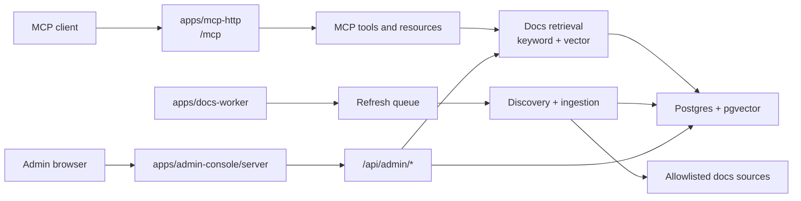

# Bun Dev Intel Remote Docs MCP

`bun-dev-intel-remote-docs-mcp` is a Bun workspace monorepo for remote documentation intelligence over Streamable HTTP, a background docs refresh worker, and an optional admin console.

The repository is intentionally a modular monolith at the source level: MCP, worker, and admin runtimes are separate deployable processes, but they share one database schema, one migration stream, and shared package APIs for contracts, database access, and docs-domain behavior.

The implemented architecture uses explicit Bun workspaces and package boundaries rather than adopting BHVR as a framework dependency.

## Repository Boundary

This repository owns:

- A Streamable HTTP MCP endpoint at `/mcp`.
- Health and readiness endpoints at `/healthz` and `/readyz`.
- Remote docs tools: `search_docs`, `get_doc_page`, and `search_bun_docs`.
- MCP resources for indexed sources, pages, chunks, and Bun docs compatibility.
- Bun docs discovery, normalization, chunking, embedding, retrieval, refresh, and tombstone handling.
- Admin API/UI for source health, pages, chunks, refresh jobs, audit events, search, and bounded operational actions.
- Shared contracts, docs-domain, and database packages used by MCP, worker, and admin runtimes.
- One canonical migration stream under `migrations/remote-docs`.
- Docker and Compose setup for MCP HTTP, docs worker, optional admin console, and Postgres/pgvector.

This repository does not own local project analysis or stdio MCP transport. Those concerns remain outside this repo; the admin console is integrated here as a separate optional app because it operates over the same schema, contracts, and operational workflows.

## Workspace Layout

- `apps/mcp-http`: startable Streamable HTTP MCP runtime.
- `apps/docs-worker`: startable scheduled/on-demand refresh worker.
- `apps/admin-console/server`: Hono admin API and static admin asset host.
- `apps/admin-console/client`: React/Vite admin browser UI.
- `packages/docs-domain`: shared docs-domain package surface for source policy, source packs, ingestion, embeddings, retrieval, refresh, and docs tool services; many exports still facade root `src/docs` and `src/tools` implementation during the migration.
- `packages/db`: Postgres client, migration runner, docs storage, row mappers, and database-facing types.
- `packages/contracts`: shared docs/MCP-adjacent DTOs, Zod schemas, and structured errors.
- `packages/admin-contracts`: browser-safe admin API DTOs and Zod schemas.
- `src`: transitional compatibility and remaining root implementation surface for existing imports, MCP registration, legacy Bun docs resources, source/cache adapters, and docs-domain facades.
- `migrations/remote-docs`: one schema migration stream for MCP, worker, and admin.
- `tests`: deterministic unit, integration, e2e, boundary, and opt-in live tests.
- `docs`: deployment guidance in `docs/deployment` plus PRDs, task trackers, and traceability under `docs/prd/<initiative>/tasks`.

## Runtime Topology



Runtime separation is operational, not repository separation:

- `mcp-http-server` handles authenticated MCP traffic only.
- `docs-worker` owns refresh, embedding, tombstone, and stale-job recovery cycles outside request handling.
- `admin-console` is optional and can be disabled for MCP-only deployments.
- `postgres-pgvector` stores pages, chunks, embeddings, refresh jobs, telemetry, admin users, sessions, and audit events.

## Package Boundaries

- Apps may import packages; packages must not import apps.
- MCP HTTP and admin server must not import each other.
- Admin client code must stay browser-safe and import only browser-safe contracts from `packages/admin-contracts`.
- `packages/db` owns database-facing code and migration execution.
- `migrations/remote-docs` is the only canonical schema stream.
- `packages/contracts` and `packages/admin-contracts` define boundary DTOs and validation schemas.
- `packages/docs-domain` exposes the shared docs source policy, ingestion, retrieval, and refresh APIs used by MCP, worker, and admin.

Compatibility wrappers remain intentionally during the incremental migration:

- `src/http.ts` and `src/docs-worker.ts` delegate to app entrypoints.
- `src/docs/storage/*` re-export `packages/db`.
- `src/shared/*` re-export `packages/contracts`.
- Most `packages/docs-domain/src/docs/**` and `packages/docs-domain/src/tools/**` files are facade exports over transitional root docs-domain implementation files.

New app code should prefer workspace package imports over root compatibility paths.

## MCP Surface

### Tools

- `search_docs`: searches indexed official docs with keyword, semantic, or hybrid retrieval.
- `get_doc_page`: returns one stored allowlisted page and its indexed chunks.
- `search_bun_docs`: compatibility wrapper for Bun documentation search, backed by the same remote retrieval path.

### Resources

- `docs://sources`: enabled source packs and indexed counts.
- `docs://page/{sourceId}/{pageId}`: one stored documentation page.
- `docs://chunk/{sourceId}/{chunkId}`: one stored documentation chunk.
- Bun docs compatibility resources for the legacy Bun docs index/page shape.

## Admin Console Surface

The admin console is served by `apps/admin-console/server` and exposes the browser UI plus `/api/admin/*` routes.

Core admin API capabilities include:

- Auth: `POST /api/admin/auth/login`, `POST /api/admin/auth/logout`, and `GET /api/admin/auth/me`.
- Overview and KPIs: `/api/admin/overview` and `/api/admin/kpis`.
- Source health and actions: list/get sources, queue refresh, tombstone, and purge/reindex actions.
- Pages and chunks: inspect indexed pages, chunks, freshness, and source-scoped details.
- Jobs: list jobs, inspect job details, and retry failed jobs.
- Search lab: run admin-side docs search through shared retrieval contracts.
- Audit events: inspect bounded operational action history.

Admin authentication uses cookie sessions backed by the shared database. Optional first-run bootstrap variables can create the initial admin user, then should be removed from the runtime environment.

## Source Policy

V1 indexes only official Bun documentation:

- `https://bun.com/docs/llms.txt`
- `https://bun.com/docs/llms-full.txt`
- pages under `https://bun.com/docs/`

The source pack rejects non-HTTPS URLs, disallowed hosts, encoded path traversal tricks, and redirects outside the same allowlisted policy. Adding another external source should include source-pack policy changes, documentation updates, and tests.

## Prerequisites

- Bun
- Docker and Docker Compose for the bundled local stack
- An OpenAI API key, or an OpenAI-compatible embedding endpoint
- Postgres with pgvector when running without Compose

The current vector schema stores 1536-dimensional embeddings. Use an embedding model or endpoint configured for 1536 dimensions unless the schema and validation are changed together.

## Configuration

Copy the example env file and replace all placeholders:

```bash
cp .env.example .env
```

Important variables:

| Variable | Purpose |
| --- | --- |
| `MCP_HTTP_HOST` / `MCP_HTTP_PORT` | MCP HTTP bind address and port. |
| `MCP_BEARER_TOKEN` | Required bearer token for `/mcp`; use a long random secret outside test mode. |
| `MCP_HTTP_MAX_REQUEST_BODY_BYTES` | Optional `/mcp` request body limit; defaults to 1 MiB. |
| `ADMIN_HTTP_HOST` / `ADMIN_HTTP_PORT` | Admin console bind address and port. |
| `ADMIN_COOKIE_SECURE` | Enables secure cookies when the admin console is served over HTTPS. |
| `ADMIN_SESSION_TTL_SECONDS` | Admin session lifetime. |
| `ADMIN_LOGIN_RATE_LIMIT_WINDOW_SECONDS` / `ADMIN_LOGIN_RATE_LIMIT_MAX_ATTEMPTS` | Login rate-limit window and threshold. |
| `ADMIN_AUTH_LOG_LEVEL` | Admin auth diagnostic verbosity: `NONE`, `INFO`, `DEBUG`, or `TRACE`. |
| `ADMIN_STATIC_ASSETS_DIR` | Built admin client asset directory served by the admin server. |
| `ADMIN_BOOTSTRAP_EMAIL` / `ADMIN_BOOTSTRAP_PASSWORD` | Optional first-run admin user bootstrap credentials. |
| `DATABASE_URL` | Postgres connection string. |
| `EMBEDDING_PROVIDER` | Must be `openai` in V1. |
| `OPENAI_API_KEY` | API key for OpenAI or an OpenAI-compatible endpoint. |
| `OPENAI_EMBEDDING_MODEL` | Embedding model name. |
| `OPENAI_BASE_URL` | Optional OpenAI-compatible `/v1` endpoint. |
| `OPENAI_EMBEDDING_DIMENSIONS` | Optional requested embedding size; currently must be `1536` when set. |
| `DOCS_ALLOWED_ORIGINS` | Optional comma-separated browser origins allowed to call `/mcp`. |
| `DOCS_REFRESH_INTERVAL` | Scheduled refresh interval, such as `7d`, `12h`, or `30m`. |
| `DOCS_WORKER_POLL_SECONDS` | Compose worker wake-up interval. |
| `DOCS_REFRESH_RUNNING_TIMEOUT_SECONDS` | Timeout used to recover stale running refresh jobs. |
| `DOCS_REFRESH_MAX_PAGES_PER_RUN` / `DOCS_REFRESH_MAX_EMBEDDINGS_PER_RUN` | Per-cycle worker bounds for page and embedding work. |
| `DOCS_REFRESH_MAX_CONCURRENCY` | Maximum concurrent page work inside the refresh worker. |
| `DOCS_SEARCH_DEFAULT_LIMIT` / `DOCS_SEARCH_MAX_LIMIT` | Default and maximum result limits for MCP/admin search. |

## Run With Docker Compose

Start the HTTP server, docs worker, and Postgres/pgvector:

```bash
docker compose --env-file .env up --build
```

Start the optional admin console profile:

```bash
docker compose --env-file .env --profile admin up --build
```

The MCP HTTP container runs migrations automatically before binding the server port. To run the same migration command manually:

```bash
docker compose --env-file .env run --rm mcp-http-server bun run db:migrate
```

Migrations are forward-only SQL files under `migrations/remote-docs/`. The runner serializes concurrent startups with a Postgres advisory lock, records applied filenames in `schema_migrations`, and skips files that are already tracked.

Default local endpoints:

```text
GET  http://localhost:3000/healthz
GET  http://localhost:3000/readyz
POST http://localhost:3000/mcp
GET  http://localhost:3100/healthz
GET  http://localhost:3100/readyz
GET  http://localhost:3100/
```

## Run Without Docker

Install dependencies, provide the same environment variables, and run the processes separately:

```bash
bun install
bun run db:migrate
bun apps/mcp-http/src/index.ts
bun apps/docs-worker/src/index.ts
bun apps/admin-console/server/src/index.ts
```

When running manually without Docker, make sure Postgres has pgvector available. The worker reuses the shared remote-docs configuration parser, so provide the MCP HTTP variables as part of the same environment even though the worker does not bind an HTTP port. Build the admin client before serving static admin assets from `apps/admin-console/client/dist`.

## Connect An MCP Client

Configure clients for Streamable HTTP:

```text
Transport: Streamable HTTP
URL: https://your-host.example.com/mcp
Authorization: Bearer <MCP_BEARER_TOKEN>
```

Generic configuration shape:

```json
{
  "mcpServers": {
    "bun-dev-intel-docs": {
      "transport": "http",
      "url": "https://your-host.example.com/mcp",
      "headers": {
        "Authorization": "Bearer ${MCP_BEARER_TOKEN}"
      }
    }
  }
}
```

Raw initialize request:

```bash
curl -sS https://your-host.example.com/mcp \
  -H "Authorization: Bearer $MCP_BEARER_TOKEN" \
  -H "Accept: application/json, text/event-stream" \
  -H "Content-Type: application/json" \
  --data '{"jsonrpc":"2.0","id":1,"method":"initialize","params":{"protocolVersion":"2025-11-25","capabilities":{},"clientInfo":{"name":"example-agent","version":"0.0.0"}}}'
```

## Security Notes

- `/mcp` requires bearer-token authentication.
- Bearer tokens in query strings are rejected.
- Request origins can be restricted with `DOCS_ALLOWED_ORIGINS`.
- Request bodies are size-limited.
- Source fetching is constrained by allowlisted source packs.
- The admin console uses cookie sessions and database-backed users/sessions.
- Admin bootstrap credentials are first-run only and should not remain set after an admin user exists.
- The worker logs sanitized failure details and avoids logging raw source content or secrets.

## Quality

Default checks are deterministic and offline:

```bash
bun test
bun run typecheck
bun run check
```

Admin client build verification:

```bash
bun run build:admin
```

Live Bun documentation checks are opt-in:

```bash
LIVE_DOCS=1 bun test tests/live
```

Deployment details, refresh behavior, monitoring queries, and source-policy notes are in [docs/deployment/remote-docs-http.md](docs/deployment/remote-docs-http.md). PRDs and implementation trackers live under `docs/prd/<initiative>/tasks`.
