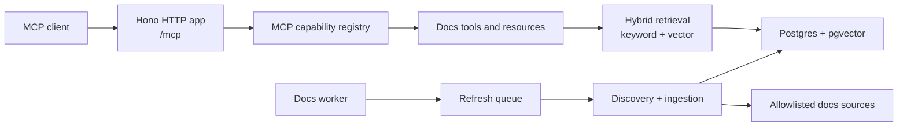

# Bun Dev Intel Remote Docs MCP

`bun-dev-intel-remote-docs-mcp` is a docs-only Model Context Protocol (MCP) service for searching and retrieving official documentation over Streamable HTTP.

It indexes allowlisted documentation sources, stores pages and chunks in Postgres with pgvector embeddings, and exposes source-backed MCP tools that agents can call remotely.

## What This Repository Owns

- A Streamable HTTP MCP endpoint at `/mcp`.
- Health and readiness endpoints at `/healthz` and `/readyz`.
- Remote docs tools: `search_docs`, `get_doc_page`, and `search_bun_docs`.
- MCP resources for indexed sources, pages, chunks, and Bun docs compatibility.
- Bun docs discovery, normalization, chunking, embedding, retrieval, refresh, and tombstone handling.
- Docker and Compose setup for the HTTP server, docs worker, and Postgres/pgvector.

This repository does not include local project analysis, stdio MCP transport, or an admin console. Those concerns are intentionally split into separate repositories.

## Architecture



Request handling stays focused on authenticated MCP traffic. Refresh, embedding, and tombstone work runs through the worker so slow source updates do not block tool calls.

## MCP Surface

### Tools

- `search_docs`: searches indexed official docs with keyword, semantic, or hybrid retrieval.
- `get_doc_page`: returns one stored allowlisted page and its indexed chunks.
- `search_bun_docs`: compatibility wrapper for Bun documentation search, backed by the same remote retrieval path.

### Resources

- `docs://sources`: enabled source packs and indexed counts.
- `docs://page/{sourceId}/{pageId}`: one stored documentation page.
- `docs://chunk/{sourceId}/{chunkId}`: one stored documentation chunk.
- Bun docs compatibility resources for the legacy Bun docs index/page shape.

## Source Policy

V1 indexes only official Bun documentation:

- `https://bun.com/docs/llms.txt`
- `https://bun.com/docs/llms-full.txt`
- pages under `https://bun.com/docs/`

The source pack rejects non-HTTPS URLs, disallowed hosts, encoded path traversal tricks, and redirects outside the same allowlisted policy. Adding another external source should include source-pack policy changes, documentation updates, and tests.

## Prerequisites

- Bun
- Docker and Docker Compose for the bundled local stack
- An OpenAI API key, or an OpenAI-compatible embedding endpoint
- Postgres with pgvector when running without Compose

The current vector schema stores 1536-dimensional embeddings. Use an embedding model or endpoint configured for 1536 dimensions unless the schema and validation are changed together.

## Configuration

Copy the example env file and replace all placeholders:

```bash
cp .env.example .env
```

Important variables:

| Variable | Purpose |
| --- | --- |
| `MCP_HTTP_HOST` / `MCP_HTTP_PORT` | HTTP bind address and port. |
| `MCP_BEARER_TOKEN` | Required bearer token for `/mcp`. Use a long random secret outside test mode. |
| `DATABASE_URL` | Postgres connection string. |
| `EMBEDDING_PROVIDER` | Must be `openai` in V1. |
| `OPENAI_API_KEY` | API key for OpenAI or an OpenAI-compatible endpoint. |
| `OPENAI_EMBEDDING_MODEL` | Embedding model name. |
| `OPENAI_BASE_URL` | Optional OpenAI-compatible `/v1` endpoint. |
| `OPENAI_EMBEDDING_DIMENSIONS` | Optional requested embedding size; currently must be `1536` when set. |
| `DOCS_ALLOWED_ORIGINS` | Optional comma-separated browser origins allowed to call `/mcp`. |
| `DOCS_REFRESH_INTERVAL` | Scheduled refresh interval, such as `7d`, `12h`, or `30m`. |

## Run With Docker Compose

Start the HTTP server, docs worker, and Postgres/pgvector:

```bash
docker compose --env-file .env up --build
```

Run migrations before first use and after schema changes:

```bash
docker compose --env-file .env run --rm mcp-http-server \
  bun -e 'import { createPostgresClient, runRemoteDocsMigrations } from "./src/docs/storage/database.ts"; const sql = createPostgresClient(Bun.env.DATABASE_URL); await runRemoteDocsMigrations(sql); await sql.end?.({ timeout: 1 });'
```

Default local endpoints:

```text
GET  http://localhost:3000/healthz
GET  http://localhost:3000/readyz
POST http://localhost:3000/mcp
```

## Run Without Docker

Install dependencies, provide the same environment variables, and run the server and worker as separate processes:

```bash
bun install
bun src/http.ts
bun src/docs-worker.ts
```

When running manually, make sure Postgres has pgvector enabled and the migrations under `migrations/remote-docs/` have been applied.

## Connect An MCP Client

Configure clients for Streamable HTTP:

```text
Transport: Streamable HTTP
URL: https://your-host.example.com/mcp
Authorization: Bearer <MCP_BEARER_TOKEN>
```

Generic configuration shape:

```json
{
  "mcpServers": {
    "bun-dev-intel-docs": {
      "transport": "http",
      "url": "https://your-host.example.com/mcp",
      "headers": {
        "Authorization": "Bearer ${MCP_BEARER_TOKEN}"
      }
    }
  }
}
```

Raw initialize request:

```bash
curl -sS https://your-host.example.com/mcp \
  -H "Authorization: Bearer $MCP_BEARER_TOKEN" \
  -H "Accept: application/json, text/event-stream" \
  -H "Content-Type: application/json" \
  --data '{"jsonrpc":"2.0","id":1,"method":"initialize","params":{"protocolVersion":"2025-11-25","capabilities":{},"clientInfo":{"name":"example-agent","version":"0.0.0"}}}'
```

## Security Notes

- `/mcp` requires bearer-token authentication.
- Bearer tokens in query strings are rejected.
- Request origins can be restricted with `DOCS_ALLOWED_ORIGINS`.
- Request bodies are size-limited.
- Source fetching is constrained by allowlisted source packs.
- The worker logs sanitized failure details and avoids logging raw source content or secrets.

## Quality

Default checks are deterministic and offline:

```bash
bun test
bun run typecheck
bun run check
```

Live Bun documentation checks are opt-in:

```bash
LIVE_DOCS=1 bun test tests/live
```

Deployment details, refresh behavior, monitoring queries, and source-policy notes are in [docs/deployment/remote-docs-http.md](docs/deployment/remote-docs-http.md).
